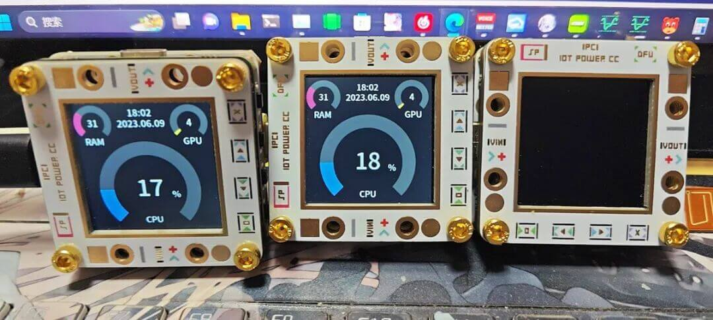

# 电脑资源占用监视器



监控电脑的CPU、内存和显卡占用，支持跨平台

## 支持的设备

- IoT Power CC

## 目前的问题

- 软件开启后会有个托盘图标，只能进任务管理器关
- 只支持N卡

## 下载

[GitHub的release页面](https://github.com/chenxuuu/IoT-Power-Tools/releases/tag/cc-monitor)

## 编译说明

安装rust环境，使用下面命令编译即可

```bash
cargo build --release
```
